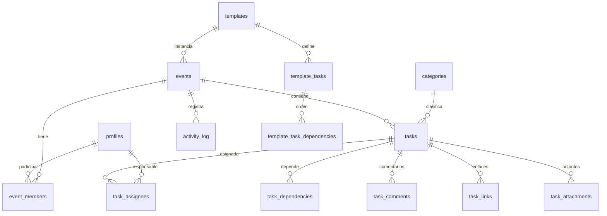

# RODEO Manager — Propuesta de arquitectura

> Documento de diseño previo a la implementación. v0.1

---

## 1. Análisis de requisitos

### 1.1 Qué es realmente el producto

No es un gestor de tareas genérico. Es un **checklist operativo de producción de eventos** con tres propiedades que condicionan todo el diseño:

1. **El tiempo es relativo a una fecha ancla** (la fecha del evento). Todo el sistema de plantillas gira alrededor de `T-60 / T-30 / T-7 / T-0`. La fecha límite de una tarea es un _dato derivado_ de `event_date + offset`.
2. **Las tareas tienen orden causal**, no sólo prioridad. Confirmar ubicación → presupuesto → precio → ticketera → lanzar venta. El estado `blocked` no es una opción que el usuario elige: es una **consecuencia calculada** del grafo de dependencias.
3. **La pregunta real del usuario no es "¿qué tareas hay?"** sino **"¿estamos listos para el evento y qué lo impide?"**. Por eso la sección _¿QUÉ FALTA PARA RODEO?_ no es decorativa: es la vista principal del producto.

### 1.2 Decisiones de producto derivadas

| Tema                | Decisión                                                     | Motivo                                                                                       |
| ------------------- | ------------------------------------------------------------ | -------------------------------------------------------------------------------------------- |
| `blocked`           | Calculado por trigger en base de datos, no editable a mano   | Si el frontend lo calcula, dos usuarios ven verdades distintas                               |
| Fechas de plantilla | `offset_days` entero (negativo = antes del evento)           | `T-60` es UI; el dato es `-60`. Permite también `T+7` (post-evento: liquidaciones, informes) |
| Asignación          | Tabla `task_assignees` con flag `is_lead`                    | Un único origen de verdad para "responsable" + "colaboradores"; evita doble escritura        |
| Historial           | Escrito por **triggers de Postgres**, nunca desde el cliente | El log debe ser incorruptible aunque alguien llame a la API directamente                     |
| Categorías          | Catálogo global gestionado por admin                         | Permite comparar "progreso por área" entre eventos distintos                                 |
| Progreso            | Ponderado por prioridad, no conteo simple                    | Que falte 1 tarea crítica no puede mostrarse como "97% listo"                                |

### 1.3 Fuera del alcance de la v1 (propuesto)

Venta de entradas, contabilidad real, integraciones externas (Google Calendar, WhatsApp), notificaciones push. La arquitectura los deja abiertos (`activity_log` + tabla `notifications` futura), pero no se implementan.

---

## 2. Arquitectura de la aplicación

### 2.1 Principios

- **Server-first**: las lecturas se hacen en React Server Components con el cliente Supabase de servidor (cookies). Nada de `useEffect` + `fetch` para pintar datos.
- **Escrituras vía Server Actions** validadas con Zod, que llaman a la capa `services/`. El cliente nunca construye queries de escritura sueltas.
- **La seguridad vive en Postgres.** RLS es la frontera real; los `if (role === 'admin')` del frontend son sólo UX.
- **Realtime como invalidación, no como estado paralelo.** Un canal por evento escucha `postgres_changes` y dispara `router.refresh()` (con debounce) + actualización optimista local. Así no existe un segundo store que se desincronice.

### 2.2 Capas

```
app/            Rutas, layouts, loading/error boundaries. Sin lógica de negocio.
features/       Un módulo por dominio: componentes, hooks, server actions, schemas Zod.
components/ui   shadcn/ui (primitivas, sin lógica de negocio).
components/     layout/ (shell, nav) y common/ (StatCard, ProgressRing, EmptyState...).
services/       Acceso a datos. Funciones puras que reciben un SupabaseClient tipado.
lib/            supabase/{client,server,middleware,admin}, date, permissions, utils, constants.
types/          database.types.ts (generado por CLI) + tipos de dominio.
supabase/       migrations/*.sql, seed.sql, config.toml
```

Regla anti-componentes-gigantes: un componente que supera ~150 líneas o mezcla fetching + UI + mutación se parte. La página compone; el feature implementa.

### 2.3 Estructura de carpetas

```
src/
├── app/
│   ├── (auth)/login/page.tsx
│   ├── (app)/
│   │   ├── layout.tsx                     # shell + nav inferior móvil + sidebar desktop
│   │   ├── dashboard/page.tsx
│   │   ├── events/page.tsx
│   │   ├── events/[id]/page.tsx           # resumen del evento
│   │   ├── events/[id]/tasks/page.tsx
│   │   ├── events/[id]/calendar/page.tsx
│   │   ├── events/[id]/team/page.tsx
│   │   ├── my-tasks/page.tsx
│   │   ├── templates/page.tsx
│   │   ├── templates/[id]/page.tsx
│   │   ├── team/page.tsx
│   │   └── settings/page.tsx
│   ├── api/admin/users/route.ts           # alta de usuarios (service role, sólo admin)
│   ├── manifest.ts                        # PWA
│   └── layout.tsx
├── components/{ui,layout,common}
├── features/{auth,events,tasks,templates,team,dashboard,activity}
├── lib/, services/, types/
└── middleware.ts                          # refresco de sesión + protección de rutas
```

---

## 3. Modelo de datos

### 3.1 Enums

```sql
user_role         : admin | member
event_status      : draft | planning | active | completed | cancelled
event_member_role : lead | member
task_status       : pending | in_progress | waiting | blocked | completed | cancelled
task_priority     : critical | high | normal | low
activity_action   : event_created | event_updated | task_created | task_updated |
                    task_status_changed | task_assigned | task_completed |
                    comment_added | attachment_added | task_deleted
```

### 3.2 Tablas

| Tabla                        | Campos clave                                                                                                                                                                                                 |
| ---------------------------- | ------------------------------------------------------------------------------------------------------------------------------------------------------------------------------------------------------------ |
| `profiles`                   | `id` (FK `auth.users`), `full_name`, `email`, `avatar_url`, `role`, `is_active`, timestamps                                                                                                                  |
| `categories`                 | `id`, `name`, `slug`, `color`, `icon`, `sort_order`, `is_active` — catálogo global                                                                                                                           |
| `events`                     | `id`, `name`, `event_date`, `venue`, `city`, `description`, `cover_url`, `status`, `template_id`, `created_by`, timestamps                                                                                   |
| `event_members`              | `(event_id, user_id)` PK, `role` (`lead`/`member`), `added_by`, `added_at`                                                                                                                                   |
| `tasks`                      | `id`, `event_id`, `category_id`, `title`, `description`, `status`, `priority`, `due_date`, `notes`, `is_milestone`, `position`, `created_by`, `completed_by`, `completed_at`, `template_task_id`, timestamps |
| `task_assignees`             | `(task_id, user_id)` PK, `is_lead` (índice único parcial: 1 lead por tarea)                                                                                                                                  |
| `task_dependencies`          | `(task_id, depends_on_task_id)` PK — `task_id` está bloqueada por `depends_on_task_id`                                                                                                                       |
| `task_comments`              | `id`, `task_id`, `author_id`, `body`, timestamps                                                                                                                                                             |
| `task_links`                 | `id`, `task_id`, `url`, `label`, `created_by`                                                                                                                                                                |
| `task_attachments`           | `id`, `task_id`, `storage_path`, `file_name`, `mime_type`, `size_bytes`, `uploaded_by`                                                                                                                       |
| `activity_log`               | `id`, `event_id`, `task_id`, `actor_id`, `action`, `payload` jsonb, `created_at`                                                                                                                             |
| `templates`                  | `id`, `name`, `description`, `is_active`, `created_by`                                                                                                                                                       |
| `template_tasks`             | `id`, `template_id`, `category_id`, `title`, `description`, `priority`, `offset_days`, `is_milestone`, `position`, `default_assignee_id`                                                                     |
| `template_task_dependencies` | `(template_task_id, depends_on_template_task_id)`                                                                                                                                                            |

### 3.3 Relaciones



### 3.4 Lógica en base de datos (no en el frontend)

**Cálculo de bloqueo** — trigger `recalc_dependents()`:

> Cuando una tarea pasa a `completed`/`cancelled`, sus dependientes se reevalúan. Si una tarea tiene alguna dependencia no completada y su estado es `pending`, pasa a `blocked`. Si se completa la última dependencia y estaba `blocked`, vuelve a `pending`. Un usuario nunca fija `blocked` a mano.

**Protección de ciclos** — trigger sobre `task_dependencies` con CTE recursiva: rechaza A→B→C→A.

**Completado** — trigger: al pasar a `completed` fija `completed_at = now()` y `completed_by = auth.uid()`; al salir de `completed`, los limpia.

**Historial** — triggers `AFTER INSERT/UPDATE/DELETE` sobre `tasks`, `task_assignees` y `task_comments` que escriben en `activity_log` con el diff en `payload`. Sin política de INSERT para clientes.

**Vistas de agregación**

- `v_event_progress`: por evento → total, completadas, pendientes, atrasadas, bloqueadas, críticas abiertas, `readiness_pct`.
- `v_event_category_progress`: lo mismo desagregado por categoría.

**Fórmula de preparación (readiness)** — ponderada por prioridad, excluyendo canceladas:

```
peso: critical=4, high=3, normal=2, low=1
readiness_pct = 100 * Σ(peso de completadas) / Σ(peso de todas)
```

**RPC `create_event_from_template(template_id, name, event_date, venue, ...)`** — `SECURITY DEFINER`, sólo admin:

1. Crea el evento.
2. Copia `template_tasks` calculando `due_date = event_date + offset_days`.
3. Remapea las dependencias de plantilla a los `task.id` reales.
4. Añade al creador como `lead` y ejecuta el recálculo de bloqueos.

### 3.5 "¿QUÉ FALTA PARA RODEO?" — reglas

Función `get_event_blockers(event_id)` que devuelve una lista ordenada por gravedad:

1. Tareas **críticas atrasadas** (`priority=critical` + `due_date < today` + no completadas)
2. Tareas **críticas bloqueadas** (y quién las bloquea)
3. **Hitos** (`is_milestone`) no completados con vencimiento en ≤14 días
4. Resto de tareas **atrasadas**
5. Tareas abiertas **sin responsable**
6. Tareas críticas **sin fecha límite**

Cada bloqueador se muestra con: título, categoría, días de retraso, responsable y **la acción de un toque** (marcar hecha / asignarme / abrir).

---

## 4. Seguridad (RLS)

### 4.1 Funciones auxiliares (`SECURITY DEFINER`, evitan recursión de políticas)

`is_admin()` · `is_event_member(uuid)` · `can_access_task(uuid)`

### 4.2 Matriz de políticas

| Tabla                             | SELECT                     | INSERT                             | UPDATE                              | DELETE                     |
| --------------------------------- | -------------------------- | ---------------------------------- | ----------------------------------- | -------------------------- |
| `profiles`                        | autenticado                | — (vía trigger de `auth.users`)    | propio (sin cambiar `role`) o admin | admin                      |
| `events`                          | admin o miembro            | admin                              | admin o `lead` del evento           | admin                      |
| `event_members`                   | admin o miembro del evento | admin                              | admin                               | admin                      |
| `tasks`                           | admin o miembro del evento | admin o miembro del evento         | admin o miembro del evento*         | admin o `lead`             |
| `task_assignees`                  | como la tarea              | admin o miembro del evento         | —                                   | admin o miembro del evento |
| `task_dependencies`               | como la tarea              | admin o miembro del evento         | —                                   | admin o miembro del evento |
| `task_comments`                   | como la tarea              | miembro (`author_id = auth.uid()`) | autor                               | autor o admin              |
| `task_links` / `task_attachments` | como la tarea              | miembro del evento                 | autor                               | autor, `lead` o admin      |
| `activity_log`                    | miembro del evento         | **ninguna** (sólo triggers)        | ninguna                             | ninguna                    |
| `templates` / `template_*`        | autenticado                | admin                              | admin                               | admin                      |

\* **Modelo abierto entre socios (decidido):** cualquier miembro del evento puede editar cualquier tarea de ese evento (estado, fechas, prioridad, asignaciones). Lo que sigue reservado a admin: borrar tareas y eventos, gestionar usuarios, plantillas y categorías. Un trigger `enforce_task_field_permissions()` impide únicamente mover una tarea de evento (`event_id` inmutable para no-admins) y fijar `status = 'blocked'` a mano.

### 4.3 Autenticación

- **Sin registro público**: `Enable signup` desactivado en Supabase Auth.
- Alta de usuarios: `POST /api/admin/users` en el servidor → verifica que el llamante es admin leyendo su sesión, y sólo entonces usa `SUPABASE_SERVICE_ROLE_KEY` con `admin.createUser()` + invitación por email. La service key nunca sale del servidor.
- Trigger `on_auth_user_created` crea la fila en `profiles`.
- `middleware.ts` refresca la sesión y redirige a `/login` lo no autenticado.

### 4.4 Storage

Bucket privado `task-attachments`, ruta `{event_id}/{task_id}/{uuid}-{filename}`. Políticas sobre `storage.objects` que reutilizan `is_event_member()` extrayendo el `event_id` del primer segmento de la ruta. Descarga mediante URLs firmadas de corta duración.

---

## 5. Árbol de páginas

| Ruta                             | Contenido                                                                                                    | Notas                      |
| -------------------------------- | ------------------------------------------------------------------------------------------------------------ | -------------------------- |
| `/login`                         | Email + contraseña                                                                                           | Sin enlace a registro      |
| `/dashboard`                     | Evento activo destacado + **¿QUÉ FALTA PARA RODEO?** + mis tareas de hoy + actividad                         | Portada real de la app     |
| `/events`                        | Lista/parrilla de eventos con anillo de progreso y cuenta atrás                                              | Filtro por estado          |
| `/events/[id]`                   | Cabecera del evento, readiness, KPIs, progreso por categoría, bloqueadores, próximos vencimientos, actividad |                            |
| `/events/[id]/tasks`             | Lista agrupable (categoría / estado / responsable), filtros, buscador, tablero en desktop, detalle en sheet  | Vista de trabajo diario    |
| `/events/[id]/calendar`          | Mes + agenda; en móvil por defecto agenda                                                                    | Hitos destacados           |
| `/events/[id]/team`              | Miembros, carga de trabajo por persona, añadir/quitar                                                        |                            |
| `/my-tasks`                      | Todas mis tareas de todos los eventos: Hoy / Atrasadas / Esta semana / Bloqueadas                            | Pestaña principal en móvil |
| `/templates` · `/templates/[id]` | Plantillas y editor de tareas con `T-x` y dependencias                                                       | Sólo admin                 |
| `/team`                          | Usuarios, roles, alta de usuario                                                                             | Sólo admin                 |
| `/settings`                      | Perfil, categorías, preferencias, instalar PWA                                                               | Categorías sólo admin      |

**Navegación móvil (bottom bar, 5 destinos):** Inicio · Evento · Mis tareas · Equipo · Más.

---

## 6. Diseño

### 6.1 Tokens

```
--rodeo-black      #0A0A0B   fondo base
--rodeo-surface    #131316   tarjetas
--rodeo-border     #26262B
--rodeo-bone       #F2EDE3   texto principal (blanco roto)
--rodeo-sand       #C9B89A   texto secundario / arena
--rodeo-gold       #C8A96A   acento primario (dorado envejecido)
--rodeo-gold-deep  #8A6F3C   bordes y hover del acento

estados: critical #C1544A · high #C8A96A · normal #6E8CA0 · low #5A5A62
         completed #6E8F63 · blocked #A2553F · waiting #8A7C63
```

Sin degradados llamativos, sin madera ni sogas, sin tipografía "far west". El carácter western viene de: negro profundo, dorado apagado, tipografía display condensada en mayúsculas con tracking amplio, filetes finos y mucho aire.

### 6.2 Tipografía

- **Display**: `Oswald` condensada, mayúsculas, tracking amplio — nombres de evento, cifras grandes, titulares (estilo cartel de concierto).
- **Texto**: `Inter` para todo lo demás.
- Cifras siempre tabulares (`font-variant-numeric: tabular-nums`).

### 6.3 Mobile first

- Objetivos táctiles ≥44px, acciones primarias al alcance del pulgar.
- Sheets deslizantes en lugar de modales.
- **Dos toques máximo** para: cambiar estado de una tarea, comentar, asignarme una tarea.
- FAB contextual (nueva tarea en el evento actual).
- Estados de carga con skeletons, nunca spinners a pantalla completa.

### 6.4 PWA

`manifest.ts` + iconos maskable + service worker (Serwist) con precache del shell y estrategia _network-first_ para datos. Instalable en iOS/Android; meta `apple-mobile-web-app-*` y splash screens.

---

## 7. Plan por fases

| Fase  | Contenido                                                                                                    | Entregable verificable             |
| ----- | ------------------------------------------------------------------------------------------------------------ | ---------------------------------- |
| **0** | Scaffold Next.js + TS estricto + Tailwind + shadcn + tokens RODEO + ESLint/Prettier + estructura de carpetas | `build` verde con página de estilo |
| **1** | Migraciones SQL: enums, tablas, índices, triggers, vistas, RPC, RLS. Seed. Tipos generados                   | Migraciones aplicables desde cero  |
| **2** | Auth: login, middleware, perfiles, alta de usuarios por admin                                                | Sesión real, rutas protegidas      |
| **3** | Shell: layout, nav móvil/desktop, componentes comunes                                                        | Navegación completa                |
| **4** | Eventos: CRUD, miembros, página de resumen                                                                   | Crear evento y equipo              |
| **5** | Tareas: lista, filtros, detalle, estados, comentarios, enlaces, adjuntos, dependencias                       | Núcleo funcional                   |
| **6** | Dashboard + ¿QUÉ FALTA PARA RODEO? + `/my-tasks`                                                             | Vistas de decisión                 |
| **7** | Plantillas + creación de evento desde plantilla + carga de los procesos reales de RODEO                      | Evento generado en 1 clic          |
| **8** | Realtime, actividad, calendario                                                                              | Colaboración en vivo               |
| **9** | PWA, accesibilidad, rendimiento, README, deploy en Vercel + GitHub                                           | Producción                         |

Al cierre de cada fase: `tsc --noEmit` · `next lint` · `next build`, sin errores pendientes.

---

## 8. Riesgos y mitigaciones

| Riesgo                                                           | Mitigación                                                                       |
| ---------------------------------------------------------------- | -------------------------------------------------------------------------------- |
| Recursión infinita en políticas RLS (`events` ↔ `event_members`) | Funciones `SECURITY DEFINER` con `search_path` fijo                              |
| Realtime expone filas que RLS oculta                             | Realtime respeta RLS; además los canales se filtran por `event_id`               |
| Ciclos de dependencias que congelan tareas                       | Trigger de detección de ciclos + aviso en UI al crear la dependencia             |
| Cambio de fecha del evento                                       | Acción "recalcular fechas" que desplaza los vencimientos manteniendo los offsets |
| Fuga de la service role key                                      | Sólo en route handlers de servidor; nunca en `NEXT_PUBLIC_*`                     |
